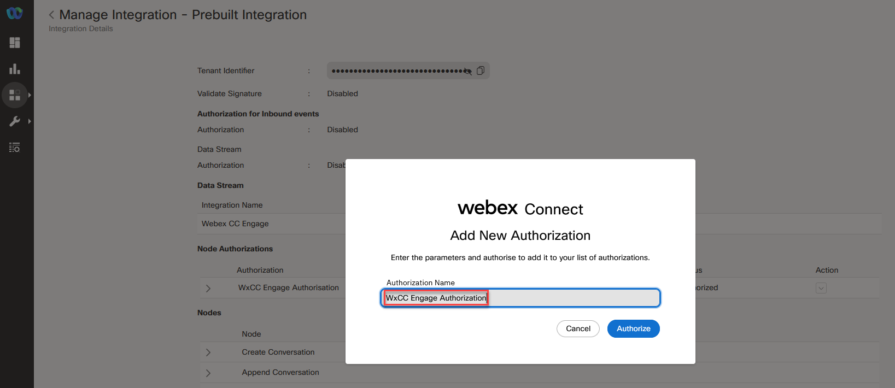

# Introduction

### Lab pre-configuration and agent setup

Since the digital channels labs are in a shared tenant, the first 3 configuration steps have been done for you to save time and potentially duplicated efforts in the labs. Please note that these steps must be undertaken if you want to turn up digital channels in a true production environment, so we will note them here for your future reference.

Please look over steps 1, 2 & 3, then proceed to steps 4 & 5 which will require admin configuration.

Once you complete this preconfiguration lab, you are free to move on to either Lab 2 (email), 3 (chat), 5 (SMS) or 6 (WhatsApp) depending on your preference.

# Table of Contents

- [Step 1. Node Authorization for Webex CC Task and Engage nodes](#Node-authorization)
- [Step 2. Download and upload CA flows in Connect](#Update-CA-nodes-in-connect)
- [Step 3. Setup RONA Timers](#RONA-Timers)
- [Step 4. Setup Multimedia profile](#Multimedia-profile)
- [Step 5. Add a service for your flows](#Add-a-service)
- [Step 6. Setup Agents & teams in portal](#Agents-teams)
- [Step 7. Verify access to the agent desktop](#Agent-desktop-access)

### Pre-requisites

- You have received the access credentials with a full admin access
- You have received the access to the agent and supervisor account.

### Quick Links

> Control Hub: **[https://admin.webex.com](https://admin.webex.com){:target="\_blank"}**\
> Portal: **[https://portal.wxcc-us1.cisco.com/portal](https://portal.wxcc-us1.cisco.com/portal){:target="\_blank"}**\
> Agent Desktop: **[https://desktop.wxcc-us1.cisco.com](https://desktop.wxcc-us1.cisco.com){:target="\_blank"}**\
> Webex Connect: **[https://labtenant.us.webexconnect.io/](https://labtenant.us.webexconnect.io/){:target="\_blank"}**\

# Lab Section

### Configuration Order

 
 

## Step 1. Node Authorization for Webex CC Task and Engage nodes - This step has been preconfigured for you

Webex Connect is required to provide a valid access token for using various Webex Contact Center and Webex Engage APIs. The access token is generated using the authorization details configured within the ‘Node Runtime Authorization’ field that Webex Contact Center users are required to provide during flow configuration.

- To authorize a pre-built integration login into Webex connect and go to **Assets** -> **Integrations**. The integrations which are not yet authorized show the status as **Authorization Pending**.

- In front of **Webex CC Engage** Click **Actions** -> **Manage**.

 
 

- On the Manage Integrations page, scroll down to the **Node Authorizations** section. This section lists all the authorizations mapped to this integration.

- Click **Action** → **Add Authorization** associated with the **WxCC Engage Authorization**, where Auth Type is oauth2 and Status is Authorization Pending.

 
 

- Enter the Authorization Name and click **Authorize**. In that example we use **WxCC Engage Authorization**.

 
 

- Click on the back button for being redirected back to **Integrations** page and in front of **Webex CC Task** Click **Actions** → **Manage**.

 
 

- On the Manage Integrations page, scroll down to the **Node Authorizations** section. This section lists all the authorizations mapped to this integration. Click **Action** → **Add Authorization** associated with the **WxCC Authorisation**, where Auth Type is oauth2 and Status is Authorization Pending.

 
 

- Enter the **Authorization Name** (for example: **WxCC Authorisation**) and click **Authorize**. As the result the pop-up appears where you need to enter your Cisco admin email address and click **Sign in**.

 
 

- Click back button for being redirected back to **Integrations** page. Verify that the status of the authorizations is changed to **Authorized**.
  
   
   

## Step 2. Download and upload CA flows in Connect - This step has been preconfigured for you

Every tenant must include CA flows. CA flows can be imported from the template folder in this [GitHub page](https://github.com/CiscoDevNet/webexcc-digital-channels/tree/main/Webex%20Connect%20Flows/v3.0/Template/Event%20Handling%20Workflows){:target="\_blank"}. CA flows can be added only once and will be automatically be used by all existing channel specific flows in the tenant when needed. It is recommended to add these flows in a dedicated Service named “Agnostic Flows - DO NOT MODIFY”

> The agnostic flows consist of:\
> • Task Routed - Adding an agent participant to a conversation;\
> • Task Modified - Adding an agent to or removing an agent from an ongoing conversation (e.g., for chat transfer or conference);\
> • Task Close - Closing the conversation;

1. Download all flows from the [GitHub page](https://github.com/CiscoDevNet/webexcc-digital-channels/tree/main/Webex%20Connect%20Flows/v3.0/Template/Event%20Handling%20Workflows){:target="\_blank"}.

2. Navigate to **webex connect -> v3.0 -> template -> event handling workflows**

 
 

3. Unzip All Files.

4. Login to the **Webex Connect** portal with the admin account.

5. Navigate to **Services** and click on **CREATE NEW SERVICE**.

 
 

6. Set your name **Agnostic Flows DO NOT MODIFY** in the Service Name and press on **CREATE** button. This will create a new service.

   > **Note** You can choose a different Service name. It is just an exmple.

7. In the service click on **FLOWS** -> **CREATE FLOW**.

 
 

8. In the **FLOW NAME** section set **Task Close Flow**.

9. In the **METHOD** select **Upload a flow**. In **ATTACHMENT** click on **CHOOSE FILE** and select the **Task Close.workflow** file.

10. Now you can click on **CREATE** button.

 
 

11. In the new menu click **SAVE** and then **MAKE LIVE**. On pop up window click on **MAKE LIVE** again.

 
 

12. **!!!** Go back and repeate steps 7 - 11 for **Task Routed flow** and **Task Modified Flow**. Select the corresponding names.

## Step 3. Setup RONA timers - This step has been preconfigured for you

If an agent doesn’t answer a contact request, the contact request will return to the queue and the agent state will change to **Redirection on No Answer (RONA)**. In this task, you will play with the feature that allows administrators to override the default RONA timeout values at the tenant level for every channel type to suit the business needs of the organization. The available channels are:

- Telephony
- Chat
- Email
- Social (Facebook and WhatsApp)

- Log in to the Control Hub at [https://admin.webex.com](https://admin.webex.com){:target="\_blank"}

- Navigate to **Services** -> **Contact Center** -> **Settings** -> **Desktop** -> **RONA Timeouts**.
  
   
   

- Modify the existing timers by putting the values from the tables below:

| **Channel** | **New Values** | **Limitations**  |
| ----------- | -------------- | ---------------- |
| Telephony   | 18             | 1 - 120 seconds  |
| Chat        | 60             | 1 - 6000 seconds |
| Email       | 90             | 1 - 6000 seconds |
| Social      | 60             | 1 - 6000 seconds |

## Step 4. Create a new Multimedia profile and a new site - This step has been preconfigured for you

- Login to Managment Portal by accessing https://portal.wxcc-us1.cisco.com/portal.
- Enter the admin email address and click Sign in.
- Click on Provisioning and select Multimedia Profiles.
- Click on + New Multimedia Profile to open Multimedia Profile configuration page.
- Input Name as MMP.
- In the Media Details section, select the blended multimedia profile and input `1` for Voice, `3` for Chat, `3` for Email, , `3` for Social Channel and click on Save button.

 
 

### Step 4.1. Create a new site

- Navigate to Provisioning and select Site.
- Click on + New Site button and provide the Name as Site.
- Select MMP in the Multimedia Profile drop down and hit Save.

 
 

## Step 5. Create a new service for your Digital channel flows

Navigate to Webex Connect: \*\*[https://labtenant.us.webexconnect.io](https://labtenant.us.webexconnect.io){:target="\_blank"}

- Click “Create New Service” button and add a service named My First Service <0XX> where 0XX is your 3 digit Lab ID. In all subsequent labs, assets will be associated to this service

 
 

## Step 6. Setup agents in Portal (Agents, Team)

> This step shows how to access the admin portal and navigate the different configuration menus to create a Site, Team, and Multimedia Profile that will be assigned to the Contact Center user.

### Users

The users have the following preconfiguration

| **User Role** | **User email**                     |
| ------------- | ---------------------------------- |
| Agent         | wxcclabs+agent\_ ID<0XX>@gmail.com |
| Supervisor    | wxcclabs+supvr\_ ID<0XX>@gmail.com |

> **Note:** Your admin account password was given to you personally. <0XX> is your 3 digit lab number.

### User Settings

| **Entity**          | **Name**  |
| ------------------- | --------- |
| Multimedia Profiles | MMP       |
| Site                | Site      |
| Team1               | Team1_0XX |
| Team2               | Team2_0XX |

### Step 6.1. Create new Teams

- Navigate to **_Provisioning_** and select Team.

- Click on + New Team.

- Select **_Site_** from the Site drop-down.

- Input Name as `Team1_0XX`

- Use the default Type `Agent Based`.

- Select MMP in the **_Multimedia Profile_** drop-down.

- Leave `Global Layout` in the Desktop Layout drop-down as the default value and hit Save.

Please follow the same steps as above to add an extra Team as `Team2_0XX`

### Step 6.2. User Configuration

- Click on **_Provisioning_** and select **_Users_**.

- Click on `...` for the **Agent** user, to launch the **_Edit_** view for the agent that is designated for your lab: wxcclabs+agent\_ ID<0XX>@gmail.com.

- Make sure that the **_User Profile_** is set as **_Premium Agent User Profile_**.

- Click on **_Contact Center Enabled_** toggle to move it to **_On_**.

- In the **_Agent Settings_** section, select `Site` in the **_Site_** drop-down.

- Click the **_Teams_** area and select `Team1_0XX` and `Team2_0XX`.

- Select `Agent Profile` in the **_Agent Profile_** drop-down list.

- Select `MMP` in the **_Multimedia Profile_** drop-down and hit **_Save_**.

- Make sure that the user are now shown with the **_Contact Center Enabled_** flag as `Yes` and **_Status_** as `Active`.

 
 

- Please follow the same steps for **Supervisor** user.

[To top of this lab](#table-of-contents)

## Step 7. Verification: Access to the Agent Desktop

> **Note**: To log in to the agent desktop, use either a separate web browser or a new incognito web page. This will prevent any browser caching issues with admin and agent credentials.

- Navigate to **[https://desktop.wxcc-us1.cisco.com/](https://desktop.wxcc-us1.cisco.com/){:target="\_blank"}** in a new browser or in incognito mode.

- Enter the agent’s **email ID** `wxcclabs+agent_ ID<0XX>@gmail.com`.

- Enter the **Password** for the appropriate Username.

- In the **_Station Login_** pane, select **"Extension"** and enter any number, for instance 1000.

> **Note:** The Webex Calling service is not activated at this tenant we need to set a dummy extension only once during the login.

- Select the `Team1_0XX` and click **_Submit_**. Make sure that you are successfully logged in to the Agent Desktop. Now you can continue with the Next Lab.

 
 

[To top of this lab](#table-of-contents)

---

### Congratulations, you have compleated Lab1 tasks!

<button onclick="mainPage()" style="
  border-radius: 5px;
  background-color: rgb(116,191,75);
  padding: 10px;">Main Page</button>

<button onclick="nextLab()" style="
  position: absolute;
  right: 200px;
  border-radius: 5px;
  background-color: rgb(116,191,75);
  padding: 10px;">Next Lab</button>

